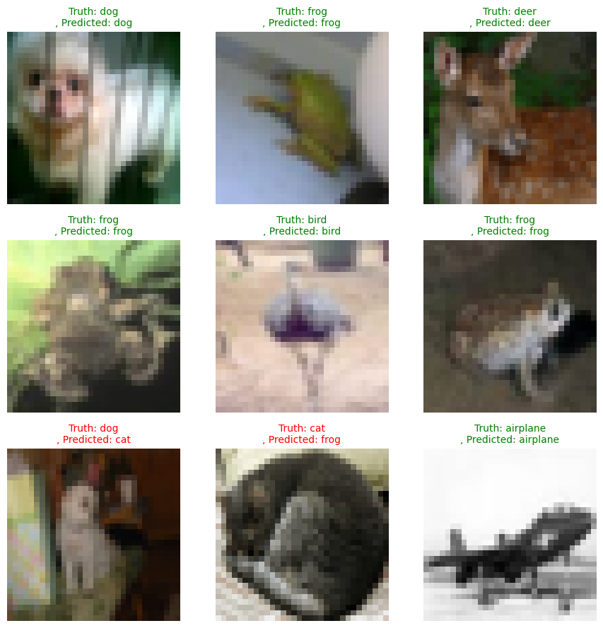
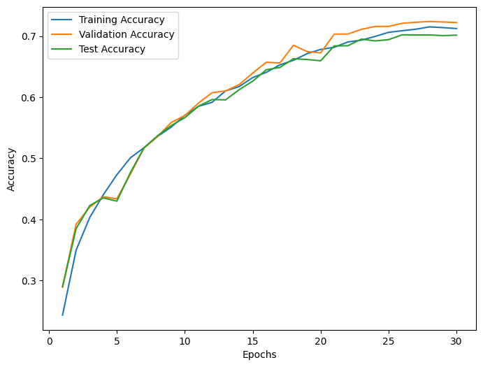

# Vision Transformer (Tiny-ViT) — PyTorch, CIFAR-10

A lightweight Vision Transformer built from scratch for image classification on CIFAR-10, developed on Google Colab.


## Overview

Implemented a Vision Transformer from scratch, including patch embedding, multi-head self-attention, positional encoding, and MLP blocks. Built the full training pipeline with data augmentation, cross-entropy loss, and Adam optimization. Trained and tuned hyperparameters to achieve stable convergence and improved generalization on CIFAR-10.

---
## Project Structure

```
tiny-vit-cifar10/
├── model.py          # Tiny-ViT architecture 
├── results/
│   ├── loss_curve.png
│   └── result.png

```

## Model Architecture

| Component          | Details |
| ------------------ | ------- |
| Image size         | 32×32   |
| Patch size         | 4×4     |
| Num patches        | 64      |
| Embedding dim      | 256     |
| Transformer blocks | 8       |
| Attention heads    | 9       |
| MLP hidden dim     | 512     |
| Dropout            | 0.1     |

## Dataset

- **Dataset:** CIFAR-10
- **Train set:** 40,000 images (32×32 RGB, 10 classes)
- **Validation set:** 10,000 images (split from original 50,000 training images)
- **Test set:** 10,000 images
## Data Augmentation

Applied during training only. Includes RandomHorizontalFlip, RandomCrop (padding=4), ColorJitter, RandAugment, RandomErasing, and normalization. Validation and test sets use normalization only.

## Training

| Parameter     | Value                                    |
| ------------- | ---------------------------------------- |
| Epochs        | 30                                       |
| Batch size    | 150                                      |
| Learning rate | 3e-4                                     |
| Optimizer     | Adam                                     |
| LR Scheduler  | CosineAnnealingLR                        |
| Loss          | CrossEntropyLoss + Label Smoothing (0.1) |

No random seed is set — results are non-deterministic across runs.
## Results

| Metric        | Approximate Value |
| ------------- | ----------------- |
| Val Accuracy  | ~72.2%            |
| Test Accuracy | ~70.14%           |


## Environment

Google Colab (T4 GPU) · PyTorch · torchvision · Matplotlib · June 2025
## Future Work

- Fix a random seed (torch.manual_seed, NumPy, Python random, cudnn deterministic) for reproducible experiments.
## CIFAR-10 Classes

airplane · automobile · bird · cat · deer · dog · frog · horse · ship · truck
